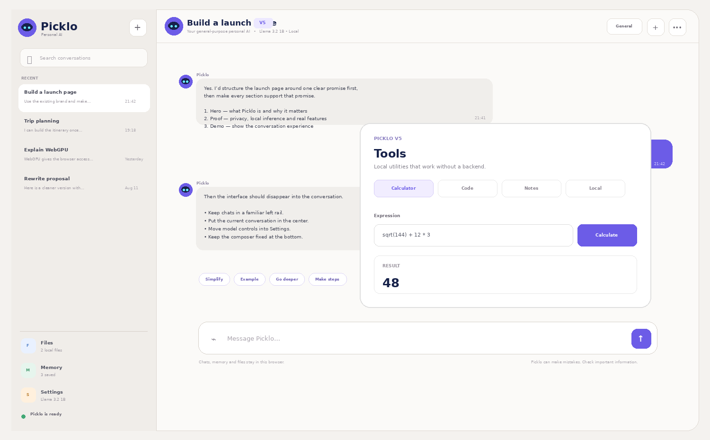

<div align="center">


### Chat. Think. Use tools. Stay local.


<br><br>



</div>

# Picklo V5

**V5 is the tools release.** Picklo keeps the V4 chat-first interface, white/true-black themes, memory, local files and persistent chats, then adds a local utility layer.

## New in V5

- Built-in **calculator** with a custom parser — no `eval`.
- **Sandboxed JavaScript runner** for small experiments.
- **Quick Notes** stored locally but kept separate from AI memory.
- **Current date/time** tool from the browser.
- **Local file search** shortcut into Analyze mode.
- **Copy** action on messages.
- **Regenerate** action on Picklo replies.
- V4 browser-state migration.

## Tool architecture

```text
Picklo V5
├── Chat
│   ├── conversations
│   ├── memory
│   └── response modes
├── Tools
│   ├── calculator
│   ├── JavaScript sandbox
│   ├── notes
│   ├── local time
│   └── local file search
├── Browser data
│   ├── localStorage
│   └── IndexedDB
└── AI runtime
    ├── WebLLM
    └── WebGPU
```

## Calculator

Supports `+ - * / % ^`, parentheses, `sqrt`, `abs`, `sin`, `cos`, `tan`, `log`, `ln`, `exp`, `pi` and `e`.

## JavaScript runner

The code runner uses a sandboxed iframe. It captures console output, returned values and runtime errors. It is intended for small JavaScript experiments, not operating-system access.

## Existing capabilities retained

- General / Write / Code / Analyze modes
- persistent chats and memory
- PDF and text/code file context
- local retrieval
- streaming responses
- stop generation
- white light mode and true-black dark mode
- fixed header and fixed composer
- data backup and restore

## Evolution

```text
V1  Local browser AI
 ↓
V2  Saved chats + memory
 ↓
V3  Brand + local document retrieval
 ↓
V4  Real chat UX
 ↓
V5  Local tools + message actions
```

## Next direction

V6 can connect the tool layer to model-driven tool calling and add a permission system for controlled external actions.
