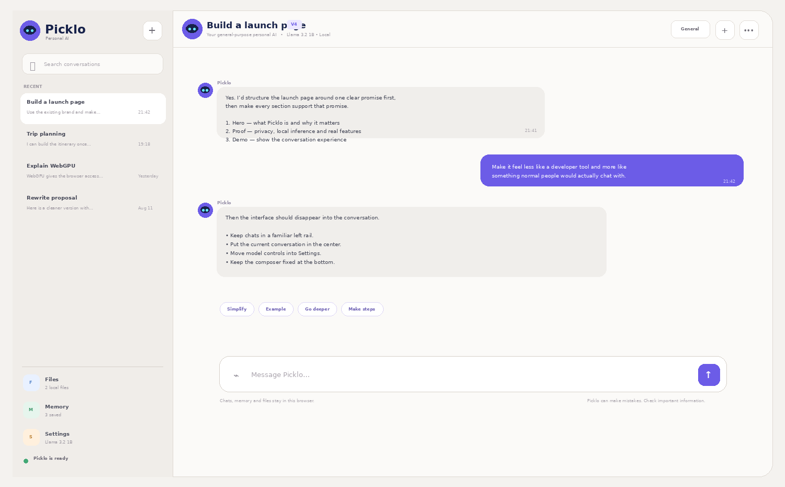

<div align="center">


### A general AI assistant that now feels like a real conversation.


<br><br>



</div>

---

# Picklo V4.1

**V4 is the conversation release.**

V3 established Picklo's identity, response modes, persistent memory and local document retrieval. V4 keeps those capabilities but reorganizes the entire product around one action:

> **Talk to Picklo.**

The interface is intentionally closer to a real messaging system and further away from an AI control panel.


## V4.1 layout fix

V4.1 fixes long-conversation scrolling behavior.

The application viewport is now locked so the conversation history becomes the **only scrolling region**:

```text
┌────────────────────────────────────┐
│ Picklo header          FIXED       │
├────────────────────────────────────┤
│                                    │
│                                    │
│ Conversation history     ↕ SCROLL  │
│                                    │
│                                    │
├────────────────────────────────────┤
│ Message composer         FIXED     │
└────────────────────────────────────┘
```

This applies on both desktop and mobile. Long messages no longer push the header or typing area off-screen.

## V4 UX redesign

```text
┌───────────────────┬──────────────────────────────────────────┐
│ Picklo            │ Picklo / Current chat            General │
│ + New chat        ├──────────────────────────────────────────┤
│ Search chats      │                                          │
│                   │   Picklo message                         │
│ Recent chats      │                           User message   │
│                   │   Picklo message                         │
│                   │                                          │
│ Files             ├──────────────────────────────────────────┤
│ Memory            │ Attach   Message Picklo…          Send   │
│ Settings          │                                          │
└───────────────────┴──────────────────────────────────────────┘
```

### What changed

- **Two-pane desktop layout** instead of a dashboard-style three-column layout.
- **Full-screen mobile chat** with conversations behind a drawer.
- **Conversation search** across titles and recent messages.
- **Conversation previews** with recent text and timestamps.
- **Real chat rhythm** with Picklo on the left and the user on the right.
- **Purple user bubbles** for instant message ownership recognition.
- **Human-sized message widths** instead of large content cards.
- **Compact chat header** with active conversation, mode and runtime state.
- **Sticky bottom composer** with attachment and send controls.
- **Quick follow-up chips** for common conversational actions.
- **Tools moved into sheets** so files, memory and model controls do not compete with the chat.
- **Less visible infrastructure** while retaining the same local-first engine.

## Core features retained

### General-purpose AI

Picklo can be used for:

- general questions;
- explanations;
- brainstorming;
- planning;
- writing and rewriting;
- coding and debugging;
- document analysis;
- structured reasoning;
- decision support.

### Four response modes

- **General**
- **Write**
- **Code**
- **Analyze**

Modes change emphasis, not what users are allowed to ask.

### Persistent conversations

Chats remain stored locally in the browser.

V4 adds:

- conversation search;
- latest-message previews;
- relative timestamps;
- improved conversation hierarchy.

### Persistent memory

Use the Memory sheet or say:

```text
remember that I prefer concise answers
```

### Local file context

Picklo can extract text from:

```text
PDF
TXT
Markdown
CSV
JSON
HTML
CSS
JavaScript
TypeScript
JSX / TSX
Python
XML
YAML
```

### Local retrieval

```text
Question
   ↓
Extract important terms
   ↓
Search local document chunks
   ↓
Rank matching passages
   ↓
Add selected context
   ↓
Generate response locally
```

### Local model runtime

Picklo uses WebLLM + WebGPU for in-browser language-model inference.

## V3 → V4 migration

When no V4 state exists, Picklo checks for `picklo-v3-state` and migrates supported V3 browser data.

That includes:

- conversations;
- persistent memory;
- model preference;
- response-mode preference.

The local document database remains compatible with the V3 file store.

## Privacy architecture

```text
Browser
├── localStorage
│   ├── chats
│   ├── memory
│   └── preferences
│
├── IndexedDB
│   └── local document text
│
└── WebGPU
    └── language-model inference
```

Picklo V4 still requires no custom Picklo backend, cloud database, OpenAI API key or Picklo account.

## Project structure

```text
picklo-v4/
├── assets/
│   ├── picklo-logo.svg
│   ├── picklo-mark.svg
│   └── picklo-v4-preview.png
├── index.html
├── styles.css
├── app.js
├── manifest.webmanifest
├── sw.js
└── README.md
```

## GitHub Pages

1. Upload the V4 files to your existing Picklo repository.
2. Commit them to `main`.
3. Preserve the V3 release/tag.
4. Deploy `main` from `/ (root)` in **Settings → Pages**.
5. Open Picklo in a WebGPU-capable browser.
6. Open **Settings**, choose a model and start it.

## Evolution

```text
V1  Browser LLM proof of concept
 ↓
V2  Persistent chats + memory
 ↓
V3  Brand + modes + local file retrieval
 ↓
V4  Real chat UX + search + cleaner conversation hierarchy
```

## Current boundaries

V4 does not claim to provide live web search, image generation, image understanding, cloud sync, arbitrary code execution or autonomous browser control.

Those require a controlled tool architecture rather than UI-only changes.

---

<div align="center">


### Picklo V4.1

**The engine stays local. The product now feels conversational.**

</div>
