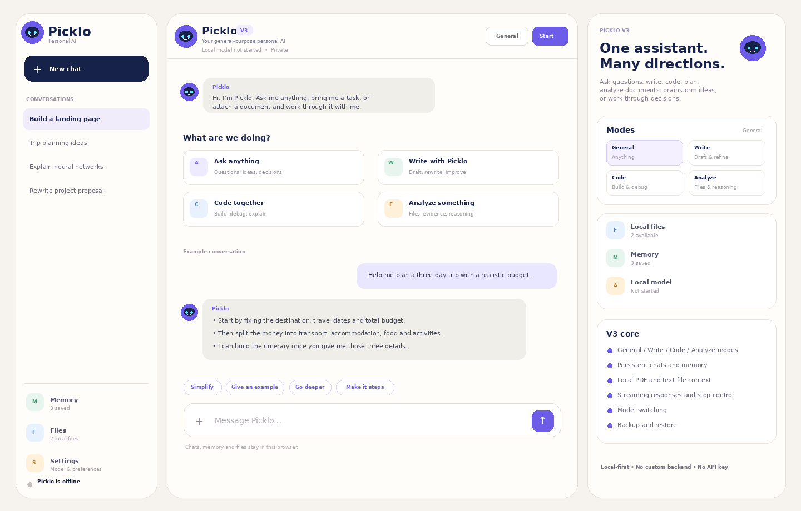

<div align="center">


<br>

### Your AI, your way.

A browser-based, local-first general AI assistant for **thinking, writing, coding, planning, brainstorming and document analysis**.

<br>


</div>

---

## Picklo V3

Picklo V3 is the biggest product change so far.

V1 proved that a real language model could run in the browser. V2 added persistent conversations, memory, model switching and local backups. **V3 turns Picklo into a product that feels like a personal assistant rather than an AI engineering demo.**

Picklo remains a general AI application powered by open language models. It is **not** a foundation model trained from scratch.

<div align="center">



</div>

## What Picklo can do

<table>
<tr>
<td width="50%">

### Ask & Think

Use Picklo for explanations, questions, brainstorming, decisions and general problem solving.

</td>
<td width="50%">

### Write

Draft, rewrite, structure and refine content with a dedicated writing mode.

</td>
</tr>
<tr>
<td width="50%">

### Code

Build, explain and debug code while keeping the full conversation available.

</td>
<td width="50%">

### Analyze

Attach local documents and let Picklo retrieve relevant passages before answering.

</td>
</tr>
</table>

## V3 highlights

- **New Picklo identity** — original mascot mark and wordmark included in the application and repository.
- **Human-first chat interface** — conversational bubbles, compact assistant identity, quick follow-ups and a mobile-app feel.
- **Four response modes** — General, Write, Code and Analyze.
- **Persistent conversations** — multiple saved chats with automatic local titles.
- **Persistent memory** — save user preferences or context and reuse them when relevant.
- **Local file context** — PDF plus common text and source-code formats.
- **Local retrieval** — Picklo selects relevant chunks from saved files before generation.
- **Runtime-aware model selection** — only models reported by WebLLM are shown.
- **Streaming output** — responses appear while the model generates.
- **Stop generation** — interrupt a response without reloading the application.
- **Markdown and code blocks** — including one-click code copy.
- **Backup and restore** — export chats, memory, preferences and local file text to JSON.
- **V2 state migration** — existing Picklo V2 local conversations and memory are imported automatically when possible.
- **PWA shell** — installable app structure and local frontend cache.
- **No application backend** — the core deployment remains static.

## Interface philosophy

Picklo V3 deliberately avoids the appearance of an AI control panel.

The model is still configurable, but it is pushed into **Settings**. The primary interface is the conversation itself. On desktop, conversations live to the left and contextual controls live to the right. On mobile, the same functionality is condensed into an app-style bottom navigation.

The result is intentionally closer to a finished consumer assistant than a model playground.

## Local file analysis

Picklo can read text from:

```text
PDF
TXT
Markdown
CSV
JSON
HTML
CSS
JavaScript
TypeScript
JSX / TSX
Python
XML
YAML
```

When a question is sent, V3 performs a lightweight local retrieval pass:

```text
Question
   │
   ▼
Token extraction
   │
   ▼
Search local document chunks
   │
   ▼
Rank matching chunks
   │
   ▼
Add relevant passages to model context
   │
   ▼
Generate response locally
```

This is intentionally lightweight. V3 does **not** require a vector database, cloud storage or embeddings server.

> Image-only scanned PDFs are not OCR'd in V3.

## Architecture

```text
┌────────────────────────────────────────────┐
│                 Picklo UI                  │
│  Chats · Modes · Memory · Files · Backup  │
└──────────────────────┬─────────────────────┘
                       │
          ┌────────────┴────────────┐
          │                         │
          ▼                         ▼
┌───────────────────┐     ┌────────────────────┐
│ Browser storage   │     │ Local file context │
│                   │     │                    │
│ localStorage      │     │ IndexedDB          │
│ - chats           │     │ - extracted text   │
│ - memory          │     │ - local retrieval  │
│ - preferences     │     └──────────┬─────────┘
└──────────┬────────┘                │
           └─────────────┬───────────┘
                         ▼
                ┌──────────────────┐
                │      WebLLM      │
                │ Streaming chat   │
                └────────┬─────────┘
                         ▼
                ┌──────────────────┐
                │      WebGPU      │
                │ Local inference  │
                └──────────────────┘
```

## Privacy model

Picklo V3 is **local-first**, not magically offline.

The Picklo application stores conversations, memory and extracted local-file text in the browser. Language-model inference runs through WebLLM/WebGPU on the user's device after the model assets are obtained. The first model load therefore still requires the model files to be downloaded.

There is no custom Picklo account server, application database or OpenAI API key in V3.

## Project structure

```text
picklo-v3/
├── assets/
│   ├── picklo-logo.svg
│   ├── picklo-mark.svg
│   └── picklo-v3-preview.png
├── index.html
├── styles.css
├── app.js
├── manifest.webmanifest
├── sw.js
└── README.md
```

## Run Picklo

### Option 1 — GitHub Pages

1. Upload the project files to your Picklo repository.
2. Open **Settings → Pages**.
3. Set the source to **Deploy from a branch**.
4. Choose `main` and `/ (root)`.
5. Save.
6. Open the published site in a WebGPU-capable browser.
7. Open **Settings** inside Picklo.
8. Choose a local model and press **Start selected model**.

### Option 2 — Any static server

Picklo is a static web application. Serve the folder over HTTP/HTTPS and open it in a WebGPU-capable browser.

Do not rely on `file://index.html`; browser module and worker restrictions make a real web origin the correct way to run it.

## How memory works

Open **Memory** and save a detail, or tell Picklo:

```text
remember that I prefer short answers unless I ask for detail
```

Saved memory is added to future model context when Picklo generates an answer.

## Model support

V3 reads WebLLM's runtime model list and prioritizes several lightweight models when they are available:

- Llama 3.2 1B Instruct
- SmolLM2 1.7B Instruct
- Llama 3.2 3B Instruct
- Phi 3.5 Mini Instruct

The exact available list depends on the WebLLM build loaded by the browser.

## Evolution

```text
Picklo V1
│
├─ Local browser inference
├─ Streaming responses
└─ Basic conversation
     │
     ▼
Picklo V2
│
├─ Saved chats
├─ Persistent memory
├─ Model switching
├─ Markdown / code rendering
└─ Backup and restore
     │
     ▼
Picklo V3
│
├─ New product identity
├─ General / Write / Code / Analyze modes
├─ Local document context
├─ Local retrieval
├─ Refined consumer chat interface
├─ V2 migration
└─ Stronger mobile experience
```

## V3 boundaries

Picklo V3 does not currently provide:

- live web search;
- cloud synchronization;
- image understanding;
- image generation;
- autonomous browser control;
- arbitrary code execution;
- multi-device accounts.

Those features require additional architecture and should not be represented as available until they are actually implemented.

## Next

V4 is the natural point to introduce a controlled **tool system**: calculator, web retrieval, code execution sandbox and explicit permissions for actions.

---

<div align="center">


**Picklo V3**

Your AI, your way.

</div>
