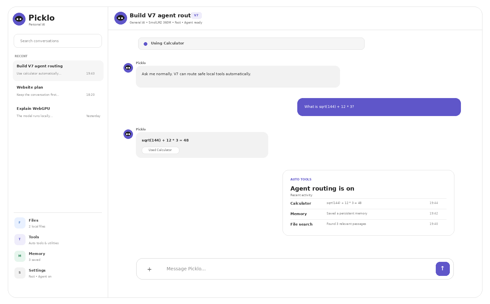

<div align="center">


# Picklo V7.1

### Agent Foundation


### [Open Picklo Live](https://kegodev.github.io/picklo/)

<br>



</div>

---

## V7.1 performance update

Picklo now starts its local model immediately after the first painted frame, keeps repeat visits fast with a stale-while-revalidate app shell, uses leaner prompt budgets, and batches streamed text updates to reduce main-thread work.

- **Faster startup:** no browser-idle delay before model loading.
- **Faster repeat visits:** cached app files render immediately while updates refresh in the background.
- **Smoother streaming:** the interface redraws at a controlled interval instead of once per token.
- **Leaner inference:** Fast, Balanced and Quality modes send smaller histories and response budgets.

## V7 is the agent foundation

V6.1 made Picklo faster. V7 adds a controlled routing layer that decides when a safe built-in tool should handle part of a request.

The default router is intentionally application-level. Small fast models do not need to produce tool-call JSON for basic tasks such as arithmetic, date/time, notes, memory, or local-file retrieval.

```text
User message
    │
    ▼
Picklo Agent Router
    │
    ├── Calculator ───────────────► direct result
    ├── Local date/time ──────────► direct result
    ├── Notes ────────────────────► save/read locally
    ├── Memory ───────────────────► save locally
    ├── File search ──────────────► retrieve context
    ├── Code request ─────────────► prepare sandbox
    │
    └── General request
             │
             ▼
       Local language model
```

## Automatic safe tools

With **Agent tools = On**, normal chat can now invoke supported local tools automatically.

### Calculator

```text
sqrt(144) + 12 * 3
```

Picklo routes the expression to its local calculator parser instead of asking the language model to guess the arithmetic.

### Local date and time

```text
what time is it?
what is today's date?
```

Picklo reads the browser device's local clock directly.

### Memory

```text
remember that I prefer concise answers
```

V7 saves the detail to persistent Picklo memory immediately.

### Quick notes

```text
save a note: redesign the landing page tomorrow
show my notes
```

Quick notes remain separate from AI memory.

### Local file search

```text
search my files for nitrate results
according to my PDF, what was the conclusion?
```

V7 invokes local document retrieval first and then gives the relevant passages to the language model.

### JavaScript preparation

```text
run javascript: console.log("hello")
```

The router loads explicit JavaScript into the existing local sandbox but does **not** execute it automatically. The user still presses **Run**.

## Visible agent activity

V7 adds status states such as:

```text
Agent ready
Using Calculator
Searching local files
Waiting for local model
Thinking
Answering
```

Tool-assisted responses also display a small tool badge in the conversation.

The Tools panel keeps a short recent activity list so users can see what Picklo routed.

## Tools can work before the model is ready

The composer is available immediately.

Calculator, date/time, notes and memory can respond even while the local language model is still loading.

For ordinary AI requests, Picklo waits for the automatically starting model and then continues the pending request.

## Agent controls

Open **Settings → Agent tools**.

```text
On  — safe local tools can route automatically
Off — chat only
```

The choice is stored locally.

## Performance retained

V7 keeps the V6.1 performance architecture:

- immediate model startup after first paint;
- Fast / Balanced / Quality modes with leaner prompt budgets;
- Web Worker inference;
- batched streaming UI updates;
- smart document retrieval;
- stale-while-revalidate app-shell caching;
- browser model caching;
- tokens-per-second display when available.

## Visual system retained

### Light

```text
Background   #FFFFFF
Text         #1F1F1F
```

### Dark

```text
Background   #171717
Surface      #222222
Text         #FFFFFF
```

V7 keeps the flat, high-contrast V6 styling without neon effects.

## V6.1 → V7 migration

When V7 has no existing local state, it checks for V6.1 data and imports supported values:

- conversations;
- memories;
- notes;
- theme;
- model selection;
- performance profile;
- response mode.

## Project structure

```text
picklo-v7.1/
├── .github/
│   └── workflows/
│       └── deploy-pages.yml
├── assets/
│   ├── picklo-logo.svg
│   ├── picklo-mark.svg
│   └── picklo-v7-preview.png
├── agent-router.js
├── app.js
├── index.html
├── manifest.webmanifest
├── styles.css
├── sw.js
├── webllm-worker.js
└── README.md
```

## Evolution

```text
V1  Browser AI
 ↓
V2  Memory + saved chats
 ↓
V3  Local document retrieval
 ↓
V4  Real chat interface
 ↓
V5  Built-in tools
 ↓
V6  Readability
 ↓
V6.1 Automatic fast startup
 ↓
V7  Automatic safe tool routing
 ↓
V7.1 Faster startup, caching and streaming
```

## Boundaries

V7 does not silently give the AI unrestricted control of the browser or device.

It does not automatically:

- browse arbitrary websites;
- access the operating-system filesystem;
- execute shell commands;
- execute JavaScript without explicit user confirmation;
- send local data to external services.

The agent layer is intentionally constrained.

---

<div align="center">


### Picklo V7.1

**Chat normally. Picklo routes the safe tools.**

</div>

